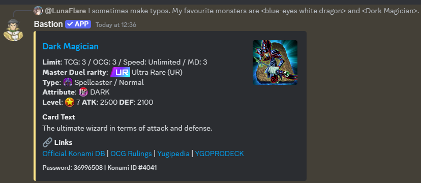
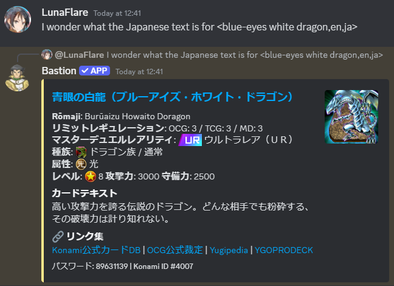

# How to use Bastion's card search

## Table of contents

1. [Getting started](#getting-started)
1. [Cleaning up](#cleaning-up)
1. [Other languages](#searching-in-other-languages)
1. [Searching by password and Konami ID](#searching-by-password-and-konami-id)
1. [Rush Duel](#rush-duel)
1. [Appendix](#appendix)

## Getting started

Simply enclose the name of the cards to search for in angle brackets `<>` as part of your
conversations to have Bastion fetch the card information for you! Example:

> I sometimes make typos. My favourite monsters are \<blue-eyes white dragon> and \<Dork Magician>. I can't believe \<GG EZ> is the name of a card!

This works in any type of channel, including forums, threads, and voice chats, as long as
Bastion is in the channel.

Completely internationalized

The card information is presented in the same Discord embeds as [`/search`](/docs/commands/search.md).

A maximum of THREE cards can be fetched per message, to avoid spamming.

Bastion _must_ have all of its [permissions](/README.md#discord-permissions) to work properly.
If you do not want `<>` card search to be used in a channel, deny it the View Channel permission.

## Cleaning up

If the message summoning Bastion is deleted within five minutes, Bastion will automatically delete its
responses. This allows non-moderators to clean up after themselves.

## Searching by password and Konami ID

Like [`/search`](/docs/commands/search.md), you can look up cards by their
[password](https://yugipedia.com/wiki/Password) (the number printed in the bottom-left corner) or
[Konami ID](https://yugipedia.com/wiki/List_of_cards_by_Konami_index_number_(4007%E2%80%935000)) (the ID assigned to the card in the [official card database](https://www.db.yugioh-card.com/)).

If your search term is just a number, it will be treated as a password. Example:

> The smallest password is \<00002511>, but it used to be <10000>

If your search term starts with `%` and is followed by a number, it will be treated as a Konami ID. Example:

> The smallest Konami ID is \<%4007>

Note: `#` cannot be used for either option because it conflicts with internal Discord syntax for channel mentions.

## Searching in other languages

Like [`/search`](/docs/commands/search.md), this uses the same [locale setting](/docs/commands/locale.md).
The search term between the brackets are treated as the configured language, and by default,
the results will be in that language.

To change the input language, add it at the end after a comma. The result language will still be the
configured language setting. Example:

> J'aime \<baguette du monde,fr>

To change both the input language and result language, add both at the end, separated by commas, in
the order `<search term,input language,result language>`. Example:

> I wonder what the Japanese text is for \<blue-eyes white dragon,en,ja>

For a full list of supported languages, see the above locale setting link.

## Rush Duel

Prefix or postfix the angle brackets with an `R` (case-insensitive) to search for Rush Duel cards
instead of OCG/TCG cards. Example:

> Blah blah r<>

You can freely mix search categories, but the maximum of three still applies. Example:

> <>R <> <>

If your search term is just a number, it will be treated as a Konami ID because Rush Duel cards do
not have passwords. Example:

> R<>

The `/rush-duel` command provides autocomplete on search and random selection.

## Appendix

### Where are TCG Speed Duel skills?

These were included in the old `<>` search somewhat by accident.
A Slash Command for skills is planned in [#446](https://github.com/DawnbrandBots/bastion-bot/issues/446).
If you have feedback, please [join the support server](https://discord.gg/4aFuPyuE96).

### When does the old bot still get triggered?

New `<>` card search runs on the new instance that also handles Slash Commands.
The old instance still handles some `<>` searches and legacy `.` chat commands.

`<>` will still trigger the old search functionality outside of threads and voice chats if the
search term contains `(` or `anime`. This is to redirect searches for unofficial cards to
the old bot, since they are not currently included in new Bastion's data.

Certain servers do not have new `<>` card search at all due to frequent
searching for unofficial cards.

### Custom brackets

Old Bastion had a niche feature for server administrators to change the brackets used for card search.
This was meant for conflict resolution with other bots and was very rarely used, and thus it is no
longer supported. A few legacy servers have their setting baked in, to be deprecated.

### Links

- [Old Bastion card search documentation](https://github.com/AlphaKretin/bastion-bot/wiki/Commands-for-users)
- [Main GitHub issue where the new search experience was worked on](https://github.com/DawnbrandBots/bastion-bot/issues/152)
- GitHub issues for the Rush Duel search experience: [#341](https://github.com/DawnbrandBots/bastion-bot/issues/341) [#468](https://github.com/DawnbrandBots/bastion-bot/issues/468)
