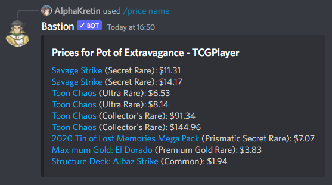

# `/price` command

Display market prices for a card as cached by YGOPRODECK. Listings are YGOPRODECK affiliate links

## Definitions

[**Password**](https://yugipedia.com/wiki/Password): the number printed in the bottom-left corner of a _Yu-Gi-Oh!_ card.

[**Konami ID**](https://yugipedia.com/wiki/List_of_cards_by_Konami_index_number_(4007%E2%80%935000)): the ID assigned to the card in the [official card database](https://www.db.yugioh-card.com/).

## Subcommands

- [`/price name`](#subcommand-price-name)
- [`/price password`](#subcommand-price-password)
- [`/price konami-id`](#subcommand-price-konami-id)

## Subcommand `/price name`

Display market prices for the card with this name.

### Parameters

Name | Required? | Description | Type
--- | --- | --- | ---
`input` | ✔ | Card name to search by, fuzzy matching supported. | text
`vendor` | ✔ | The vendor to search listings from. | one of "TCGPlayer", "Cardmarket", "CoolStuffInc"
`input-language` | ❌ | The language to search in. | one of the [supported locales](./locale.md#parameters)

## Subcommand `/price password`

Display market prices for the card with this password.

### Parameters

Name | Required? | Description | Type
--- | --- | --- | ---
`input` | ✔ | The password you're searching by. | text
`vendor` | ✔ | The vendor to search listings from. | one of "TCGPlayer", "Cardmarket", "CoolStuffInc"

## Subcommand `/price konami-id`

Display market prices for the card with this official database ID.

### Parameters

Name | Required? | Description | Type
--- | --- | --- | ---
`input` | ✔ | The Konami ID you're searching by. | text
`vendor` | ✔ | The vendor to search listings from. | one of "TCGPlayer", "Cardmarket", "CoolStuffInc"

## Current behaviour

For [`/price name`](#subcommand-price-name), if `input-language` is unspecified,
it is assumed to be the setting for the channel or server per [Bastion's locale setting](./locale.md).
A fuzzy search is performed with the provided `input` in the `input-language`.
For searches in Japanese and Korean, this will consider every possible combination of ruby and base text.

For [`/price password`](#subcommand-price-password) and [`/price konami-id`](#subcommand-price-konami-id),
a direct lookup of the card is performed using that password or Konami ID.

The public reply will either be a no-match message or any number of Discord embeds showing the listings
from the requested vendor. The listings include what print the card is and are hyperlinked (affiliate link)
to the vendor. Because of Discord character limits, the results may be distributed across a larger number
of embeds and messages than expected, since every listing is hyperlinked.
